# Specular
Калькулятор оценки планирования спринта

## Схема базы данных

```mermaid
erDiagram
    UserInvite {
        guid id
        guid userId
        guid organizationId
        guid teamId
        enum role
    }
    UserOrganization {
        guid id
        guid userId
        guid organizationId
        enum role
    }
    User ||--o{ UserOrganization: is
    User |o--o{ UserInvite: is
    User |o--o{ UserTeam: is
    User |o--o{ UserCompetence: is
    User |o--o{ UserSession: is
    User }|--o{ EstimateSession: is
    User {
        guid id
        string name
    }
    UserCompetence {
        guid id
        guid userId
        guid competenceId
    }
    Organization ||--o{ UserOrganization: is
    Organization ||--o{ Teams: is
    Organization |o--o{ UserInvite: is
    Organization ||--o{ Template: is
    Organization {
        guid id
        string name
        string description
    }
    Teams |o--o{ UserInvite: is
    Teams |o--o{ UserTeam: is
    Teams {
        guid id
        string name
        string description
        guid organizationId
    }
    Template |o--o{ TemplateCompetence: is
    Template |o--o{ TemplateCompetenceValue: is
    Template {
        guid id
        string name
        strign description
        guid organizationId
    }
    UserTeam {
        guid id
        guid userId
        guid teamId
        enum role
    }
    Competence |o--o{ TemplateCompetence: is
    Competence }|--o{ Estimate: is
    Competence }|--o{ EstimateSession: is
    Competence {
        guid id
        string name
        string description
        guid organizationId
    }
    CompetenceValue |o--o{ TemplateCompetenceValue: is
    CompetenceValue }|--o{ Estimate: is
    CompetenceValue }|--o{ EstimateSession: is
    CompetenceValue {
        guid id
        string name
        string description
        int value
        guid organizationId
    }
    TemplateCompetence {
        guid id
        guid templateId
        guid competenceId
    }
    TemplateCompetenceValue{
        guid id
        guid templateId
        guid competenceValueId
    }
    Task |o--o{ TaskCompetence: is
    Task }|--o{ Estimate: is
    Task }|--o{ EstimateSession: is
    Task {
        guid id
        string name
        string description
    }
    TaskCompetence {
        guid id
        guid taskId
        guid competenceId
    }
    Estimate {
        guid id
        guid taskId
        guid competenceId
        int competenceValueId
    }
    Session |o--o{ UserSession: is
    Session }|--o{ EstimateSession: is
    Session {
        guid id
        string name
        string description
        enum type_estimate_reestimate
    }
    UserSession {
        guid id
        guid sessionId
        guid userId
    }
    EstimateSession {
        guid id
        guid sessionId
        guid userId
        guid taskId
        guid competenceId
        int competenceValueId
    }
```

## Пользователи и организации
> Роли пользователя назначаются из списка ниже и имеют уровни доступа сверху-вних. Вверху максимально возможные права доступа, внизу - минимально возможные

| Роль        | Описание                                |
|-------------|-----------------------------------------|
| Admin       | Учётные записи, организации, интеграции |
| Header      | Команды                                 |
| ScrumMaster | Проведение сессий                       |
| Participant | Участие в сессии                        |

> Пользователь, может повысить уровень доступа любого другого пользователя но только до своего собственного уровня

#### Сценарий первого входа пользователя

- Заходит на платформу
- Регистрируется
- Получает роль **_Admin_**

#### Сценарий входа существующего пользователя

- Заходит на платформу
- Авторизуется
- Рабочее место зависит от имеющихся ролей и приглашений

#### Сценарий создания организации

- Выбирает "Добавить организацию"
- Определяет параметры организиции
- Выбирает имеющийся шаблон оценок (SP, FortisSP)
- Создание шаблона оценок (автоматически или самостоятельно)

#### Действия пользователя как Admin

- CRUD организации
- CRUD шаблонов
- CRUD пользователей (Не создание пользователя, а добавление приглашения)
- Общие настройки, интеграции
